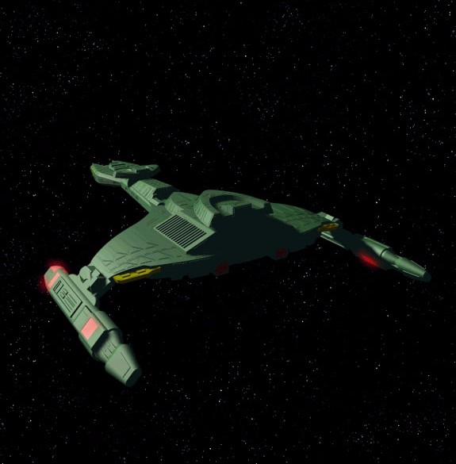



## Space Defender

### Description

Space Defender is a classical arcade

style action game.

It's a cool 2D space game with scrolling backgrounds,

stars, alien spacecrafts,

asteroids and background music.

You are in control of a fighter that can move across

the screen, dodging enemy fire

and mowing down wave after wave of bad aliens (it

looks like Raptor or Demonstar).

See the Readme file for more info, please.

For other vb games and demos visit my web site: http://web.tiscali.it/fc_vbgames/index.htm
 
### More Info
 

             |
---                |---
**Submitted On**   |2000-05-13 13:16:34
**By**             |[fabio calvi](https://github.com/Planet-Source-Code/PSCIndex/blob/master/ByAuthor/fabio-calvi.md)
**Level**          |Intermediate
**User Rating**    |5.0 (20 globes from 4 users)
**Compatibility**  |VB 5\.0, VB 6\.0
**Category**       |[Games](https://github.com/Planet-Source-Code/PSCIndex/blob/master/ByCategory/games__1-38.md)
**World**          |[Visual Basic](https://github.com/Planet-Source-Code/PSCIndex/blob/master/ByWorld/visual-basic.md)
**Archive File**   |[CODE\_UPLOAD98749132000\.zip](https://github.com/Planet-Source-Code/fabio-calvi-space-defender__1-11462/archive/master.zip)

